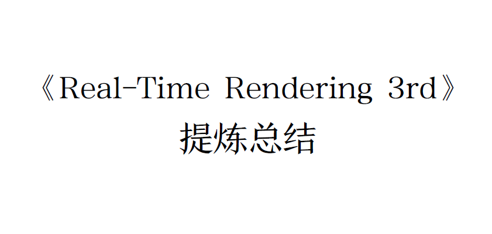
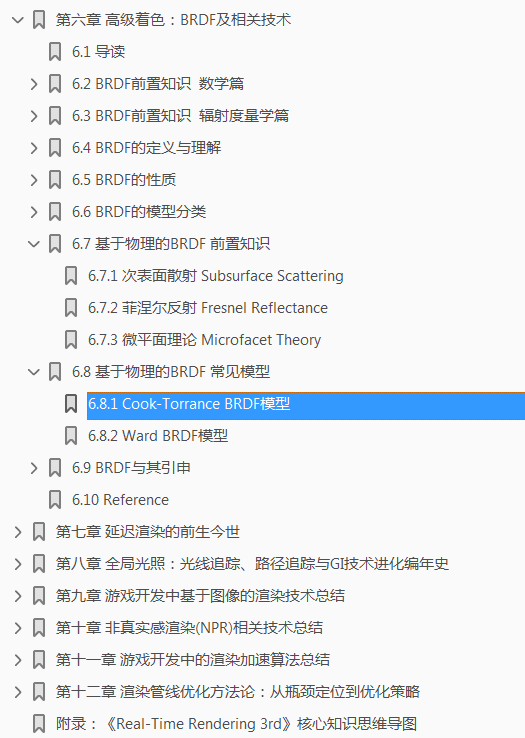
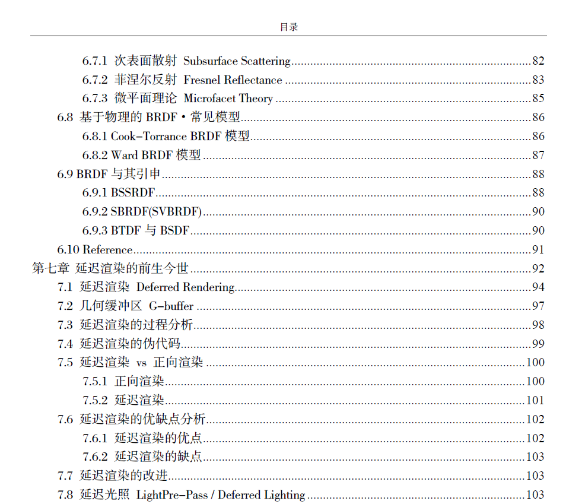
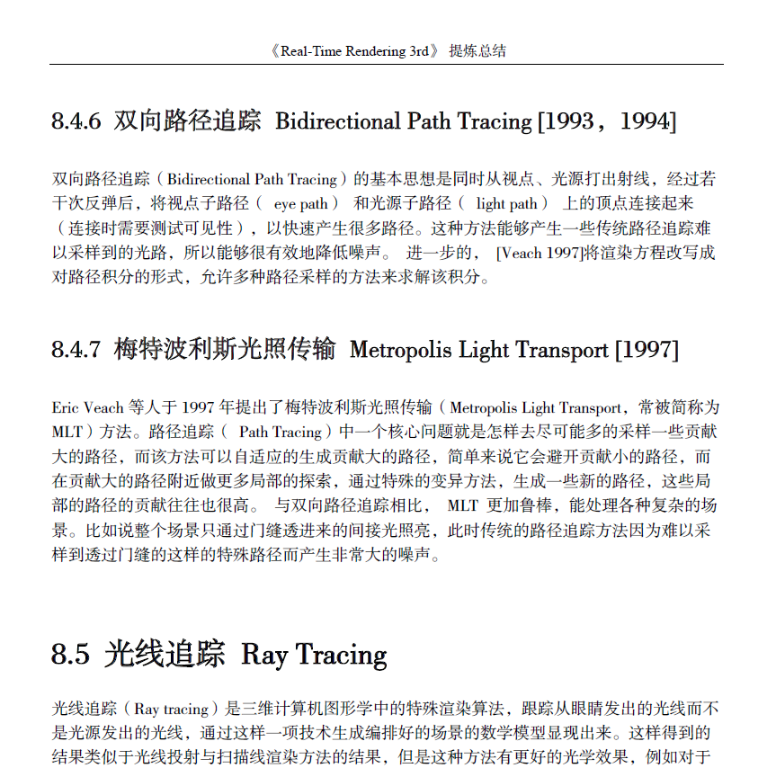

# 电子书《《Real-Time Rendering 3rd》提炼总结》

本书是系列专栏《【《Real-Time Rendering
3rd》提炼总结】》的合辑和汇编，全书共9万7千余字。你可以把它看做中文通俗版的《Real-Time Rendering 3rd》，也可以把它看做《Real-Time Rendering
3rd》的解读版与配套学习伴侣。

下载链接：
[《Real-Time Rendering
3rd》提炼总结.PDF](https://github.com/QianMo/Real-Time-Rendering-3rd-Summary-Ebook/raw/master/%E3%80%8AReal-Time%20Rendering%203rd%E3%80%8B%20%E6%8F%90%E7%82%BC%E6%80%BB%E7%BB%93.pdf)

 
书本配套思维导图“实时渲染知识网络图谱”下载链接：

[《Real-Time Rendering 3rd》核心知识网络图解.jpg](https://github.com/QianMo/Real-Time-Rendering-3rd-Summary-Ebook/raw/master/%E3%80%8AReal-Time%20Rendering%203rd%E3%80%8B%E6%A0%B8%E5%BF%83%E7%9F%A5%E8%AF%86%E7%BD%91%E7%BB%9C%E5%9B%BE%E8%A7%A3.jpg)

# 电子书前言

在实时渲染和计算机图形学领域，《Real-Time
Rendering》系列书籍一直备受推崇。有人说，它是实时渲染的圣经，也有人说，它是绝世武功的目录。

其实《Real-Time
Rendering》很像一整本图形学主流知识体系的论文综述，它涵盖了计算机图形和实时渲染的方方面面，可做论文综述合集了解全貌，也可作案头工具书日后查用。

本书是系列专栏《【《Real-Time Rendering
3rd》提炼总结】》的合辑和汇编，全书共9万7千余字。你可以把它看做中文通俗版的《Real-Time
Rendering 3rd》，也可以把它看做《Real-Time Rendering
3rd》的解读版与配套学习伴侣。

这本PDF的特点：

-   为纯文字版，支持全文搜索、快速检索

-   按照纸质出版物的标准进行了精排版

-   拥有高清的配图

-   有一点即达对应章节的详细目录

-   有精确到每章每节的书签

-   非常适合作为快速查阅的工具书之用

在内容方面，全书按照系列专栏的顺序正序收录，分为十二章：

-   第一章 全书知识点总览

-   第二章 图形渲染管线

-   第三章 GPU渲染管线与可编程着色器

-   第四章 图形渲染与视觉外观

-   第五章 纹理贴图及相关技术

-   第六章 高级着色：BRDF及相关技术

-   第七章 延迟渲染的前生今世

-   第八章 全局光照：光线追踪、路径追踪与GI技术进化编年史

-   第九章 游戏开发中基于图像的渲染技术总结

-   第十章 非真实感渲染(NPR)相关技术总结

-   第十一章 游戏开发中的渲染加速算法总结

-   第十二章 渲染管线优化方法论：从瓶颈定位到优化策略

-   附录：《Real-Time Rendering 3rd》核心知识思维导图

当你觉得《Real-Time Rendering
3rd》英文原版硬啃不下来，对照着这本书一起阅读，也许会事半功倍。而对于想快速入门实时渲染的朋友，翻翻这本书，应该也会有所收获。

正如上文说到的，你可以把这本书看做中文通俗版的《Real-Time Rendering
3rd》，也可以把它看做《Real-Time Rendering 3rd》的解读版与配套学习伴侣。

图 精确到每章每节的PDF书签

图 一点即达对应章节的书本目录

图 按照纸质出版物的标准进行精排版的正文

# 电子书配套伴侣-实时渲染核心知识网络图解

